# List Cloner

## Instalação

Primeiramente, deve-se instalar o plugin list_cloner. Para isso, em sua tela de administrador do Joomla vá em Extensions->Manage->Install e clique na aba Upload Package File como na imagem abaixo.

 

Após isso, basta navegar aos arquivos .rar da extensão necessária e arrastar para a caixa de seleção, se ocorrer tudo como esperado na instalação o resultado deve ser o seguinte.

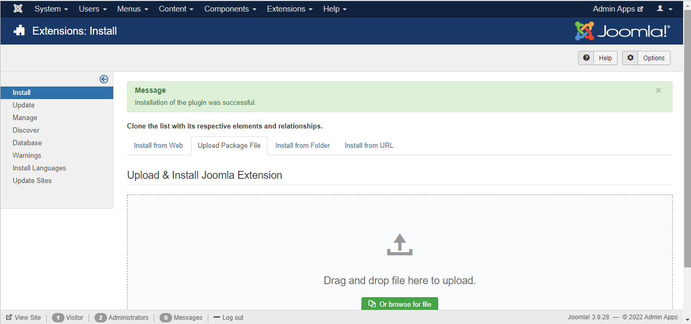

## Configurações Iniciais

Após a instalação é preciso realizar algumas etapas de configurações e verificações básicas para o correto funcionamento da API.

**1. Verificar se a extensão instalada está habilitada**

Para isso vá em Extensions->Manage->Manage e na aba de pesquisa digite "cloner" e clique enter, como na imagem abaixo. Ao aparecer o componente instalado anteriormente verifique na coluna "Status" se está habilitado, se não estiver clique em cima do ícone para habilitá-lo.

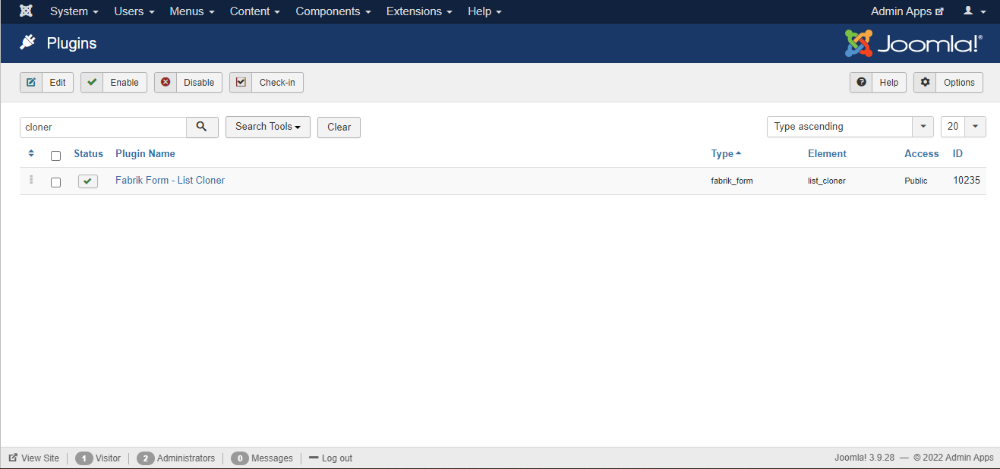

**2. Importar modelos de listas e formulários**

Agora, com o plugin instalado é necessário importar o modelo de listas e formulários para o correto funcionamento do plugin, para isso, vá em Componentes->Ferramentas administrativas e depois clique na aba "Importar e exportar listas", como mostra a figura abaixo.

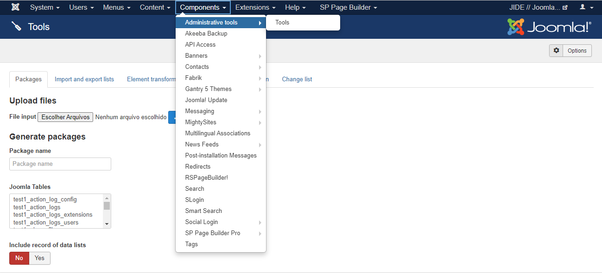

Clique em Escolher arquivo e selecione o arquivo listsToImport.json disponibilizado junto com este plugin e ao final clique em Import.

**3. Configurar o plugin**

Com o plugin vinculado ao formulário de clonagem role a tela para baixo e aparecerá a seção de configuração do plugin list_cloner. A primeira configuração list link será o elemento Link, após isso, em List title element selecione o elemento Name, em seguida, em model seleciona o elemento Modelo.

Com a execução de todos os passos anteriores como passado neste manual a configuração do plugin deve ter ficado da maneira como segue abaixo. Com isso, clique em Save & Close e as configurações de plugin, formulários e listas estará finalizada.

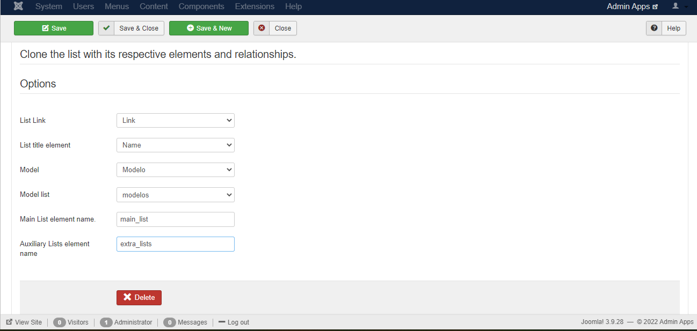

**4. Verificar elementos da clonagem**

Como a ordem de clonagem dos elementos, listas e formulários é feita de forma inversa é preciso verificar se os elementos databasejoin estão vinculados corretamente. Para isso vá em Componentes->Fabrik->Elements e filtre por plugins databasejoin. Após isso, deixe os elementos como nas figuras a seguir.

**4.1. Elemento main_list**

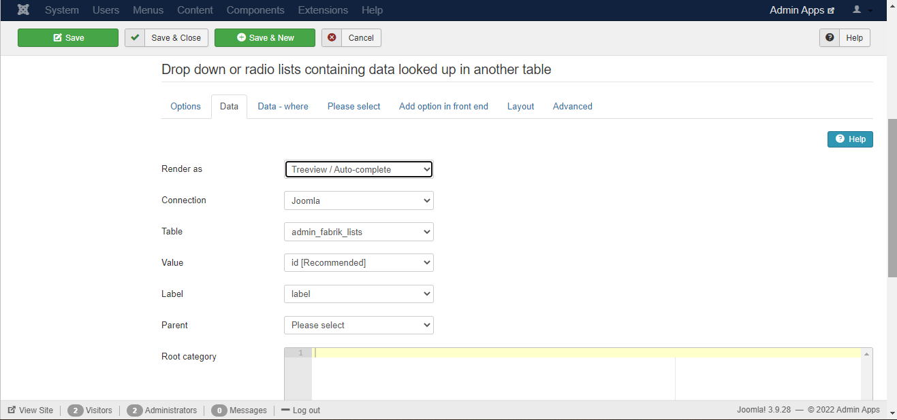

**4.2. Elemento extra_lists**

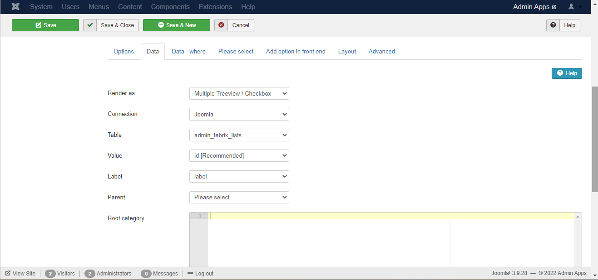

**4.3. Elemento model**

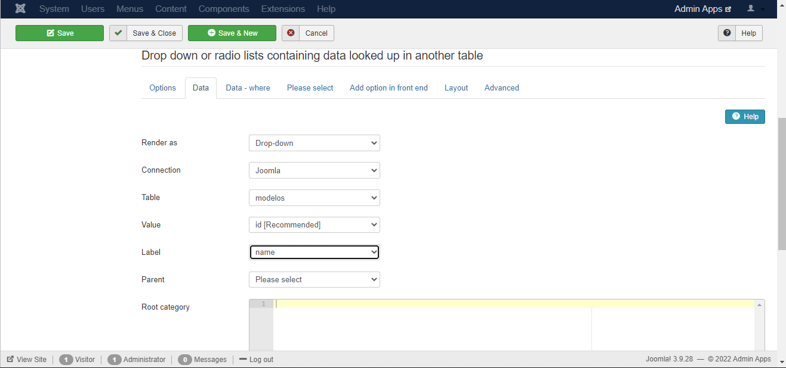

**5. Vincular itens ao menu**

Com as configurações anteriores finalizadas o próximo passo é vincular os itens criados no passo 2 ao menu principal no front-end para que seja acessado por usuários comuns, se assim for necessário. Para tal fim, vá em Menus->Main Menu no menu superior do administrador do Joomla, como segue abaixo, e depois clique em New no canto superior esquerdo da tela.

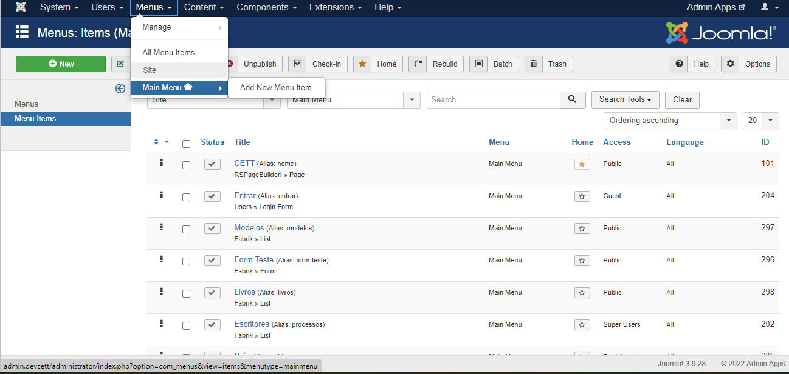

**5.1. Vincular lista de modelos**

Como devemos primeiro criar modelos de clonagem para depois realizarmos a clonagem, vamos inicialmente vincular a lista de modelos, ao menu principal. Ao ser clicado em New, se abriará as opções de configuração de um novo item de menu, dessa forma, dê um nome ao título do menu em Menu Title e em Menu Item Type precione o botão select, em seguida, ao ser aberto a opção de tipos de menus clique em Fabrik->Lists para serem carregadas todas as listas criados, na opção Fabrik List selecione a lista modelo.

Por fim, clique em Save & Close, além disso, a configuração básica deste item de menu deve estar da forma como segue.

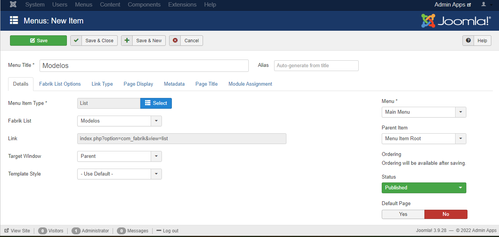

**5.2. Vincular formulário de clonagem**

Com a lista de modelos estando no front-end, devemos agora vincular o formulário em que será realizado a efetiva clonagem desses modelos. Dessa forma, dê um nome ao título do menu em Menu Title e em Menu Item Type precione o botão select, em seguida, ao ser aberto a opção de tipos de menus clique em Fabrik->Forms para serem carregadas todas os formulários criados, na opção Fabrik Form selecione a lista de clones.

Por fim, clique em Save & Close, além disso, a configuração básica deste item de menu deve estar da forma como segue.

## Utilização

Com os itens criados anteriormente vinculados ao menu do front-end podemos começar a utilizar esta poderosa ferramenta, para isso, vá no front-end do Joomla e clique no menu modelos, se tudo ocorreu como de forma correta, este item de menu deve estar da forma como segue ou bem próxima.

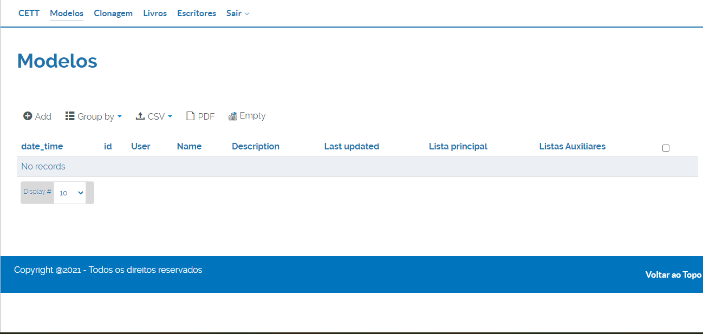

Clicando em Add se abrirá a página de formulário desta lista, dessa forma, será nesta tela em que adicionaremos os modelos padrões a serem clonados, para um simples teste, dê um nome e uma descrição a este modelo e selecione uma lista principal e uma ou várias listas auxiliares, no exemplo abaixo será criado o modelo de dados de uma livraria, em que a lista livros e escritores terão um relacionamento simples. Ao configurar seu modelo clique em Save.

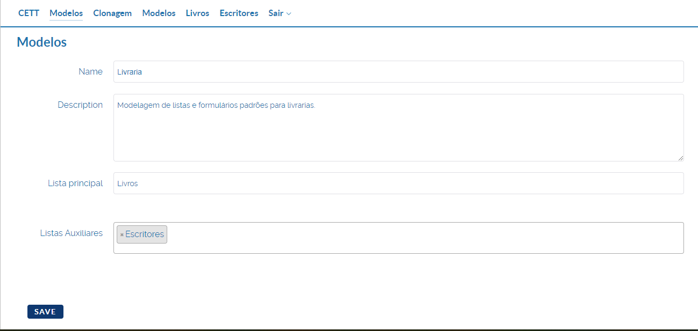

Feito isto, já podemos realizar a clonagem deste modelo quantas vezes forem necessárias, basta entrar no menu Clonagem e darmos um nome e uma descrição para esse clone, além de selecionarmos o modelo que acabamos de criar, como segue.

Por fim, clique em Save e, se tudo ocorreu corretamente nos passos anteriores, todos os relacionamentos deste modelo serão clonados, para averiguar o processo vá nas listas e formulários do fabrik no administrador do Joomla.

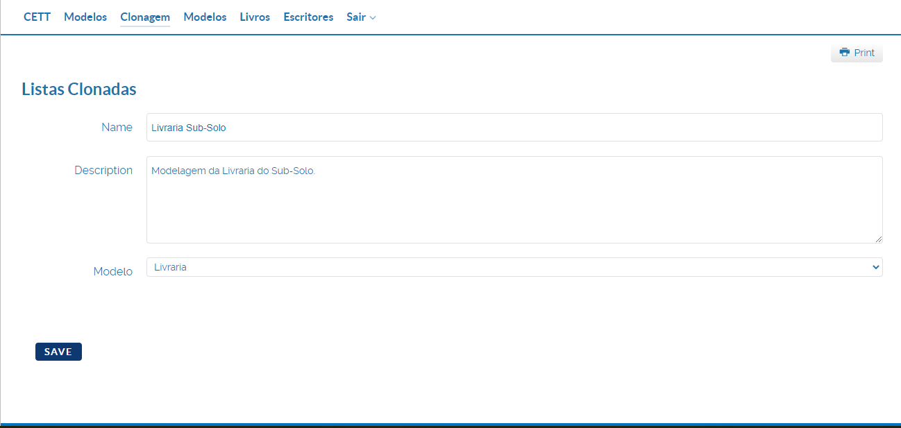